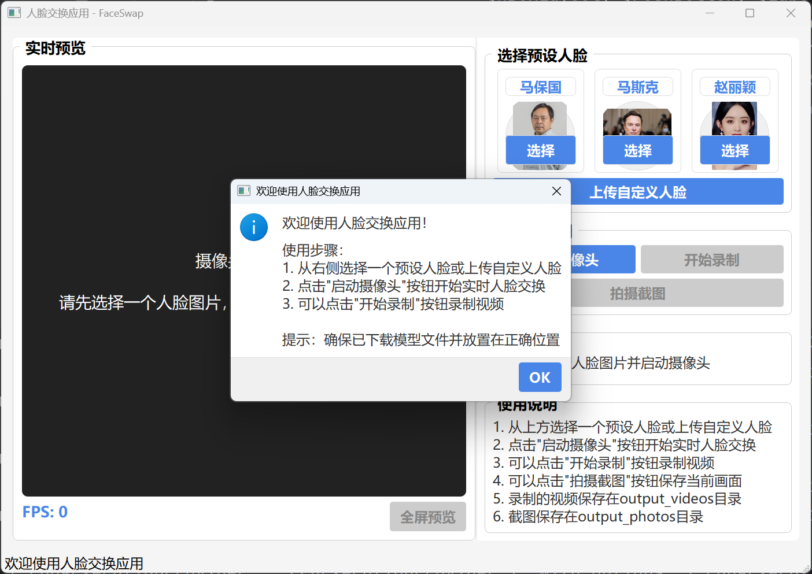
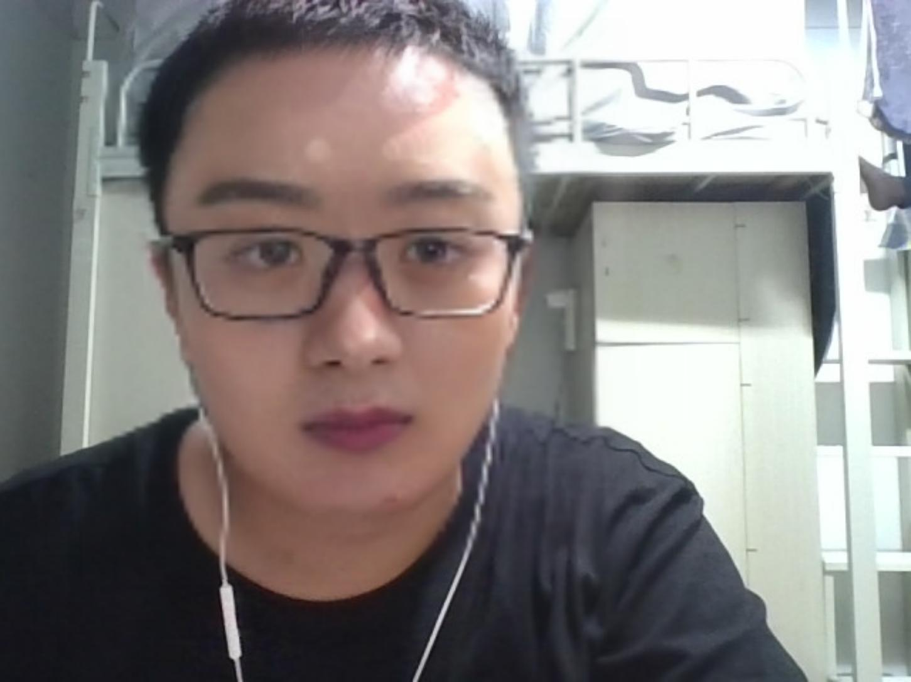

# FaceSwap 视频人脸交换应用



## 项目简介

FaceSwap是一个基于Python和PyQt5开发的实时人脸交换应用，利用先进的深度学习技术，可以在视频流中实时替换人脸。该应用提供了直观的图形用户界面，使用户能够轻松地进行人脸交换操作，并支持视频录制和截图功能。

## 功能特点

- **实时人脸交换**：通过摄像头实时捕捉并替换视频流中的人脸
- **预设人脸选择**：内置多个预设人脸（马保国、马斯克、赵丽颖）
- **自定义人脸上传**：支持上传自定义人脸图片作为替换源
- **视频录制**：可录制人脸交换后的视频并保存
- **截图功能**：支持拍摄当前画面并保存为图片
- **全屏预览**：支持全屏模式查看效果
- **友好的用户界面**：直观的操作界面，适合各类用户使用

## 演示效果

### 视频演示

https://github.com/user-attachments/assets/a5399219-1327-4b59-8a2e-30608559fe56


### 截图展示

#### 人脸交换效果示例1


#### 人脸交换效果示例2


#### 人脸交换效果示例3


## 安装说明

### 环境要求

- Python 3.7+
- OpenCV
- PyQt5
- InsightFace
- NumPy

### 安装步骤

1. 克隆仓库到本地：

```bash
git clone https://github.com/elon-zz/BigDataCourse-FaceSwapVideo.git
cd FaceSwapVideo
```

2. 安装依赖：

```bash
pip install -r requirements.txt
```

3. 下载模型文件：

从 [Hugging Face](https://huggingface.co/datasets/Gourieff/ReActor/tree/main/models) 下载 `inswapper_128.onnx` 模型文件，并将其放置在 `models` 目录下。

```bash
mkdir -p models
# 下载模型文件并放入models目录
```

## 使用方法

1. 启动应用：

```bash
cd face_swap_ui
python main.py
```

2. 使用步骤：
   - 从右侧选择一个预设人脸或上传自定义人脸
   - 点击"启动摄像头"按钮开始实时人脸交换
   - 可以点击"开始录制"按钮录制视频
   - 可以点击"拍摄截图"按钮保存当前画面
   - 录制的视频保存在output_videos目录
   - 截图保存在output_photos目录

## 项目结构

```
FaceSwapVideo/
│
├── face_swap_ui/           # 用户界面代码
│   └── main.py             # 主程序文件
│
├── face_photos/            # 预设人脸图片
│   ├── mabaoguo.jpg
│   ├── musk.jpeg
│   └── zhaoliying.jpeg
│
├── models/                 # 模型文件目录
│   └── inswapper_128.onnx  # 人脸交换模型
│
├── output_videos/          # 录制视频保存目录
├── output_photos/          # 截图保存目录
│
├── requirements.txt        # 项目依赖
└── README.md               # 项目说明文档
```

## 技术实现

本项目基于以下技术实现：

- **InsightFace**：用于人脸检测和识别
- **PyQt5**：构建图形用户界面
- **OpenCV**：处理视频流和图像
- **多线程处理**：使用QThread实现摄像头捕获和处理的并行执行，提高性能

## 常见问题

1. **问题**：应用启动时提示"请下载换脸模型并放置在正确位置"
   **解决方案**：从[Hugging Face](https://huggingface.co/datasets/Gourieff/ReActor/tree/main/models)下载`inswapper_128.onnx`模型文件，并放置在`models`目录下。

2. **问题**：摄像头无法启动
   **解决方案**：确保您的摄像头设备正常工作，并且没有被其他应用程序占用。

3. **问题**：人脸检测不准确
   **解决方案**：尝试在光线充足的环境中使用，并确保面部清晰可见。

## 未来计划

- 添加更多预设人脸
- 优化人脸检测算法，提高准确性
- 增加更多视频特效
- 支持批量处理图片和视频文件
- 开发移动端应用

## 贡献指南

欢迎对本项目做出贡献！您可以通过以下方式参与：

1. 提交Bug报告
2. 提出新功能建议
3. 提交代码改进
4. 完善文档

## 许可证

本项目采用 MIT 许可证。详情请参阅 [LICENSE](LICENSE) 文件。

## 联系方式

如有任何问题或建议，请通过以下方式联系我们：

- 电子邮件：your.email@example.com
- GitHub Issues：[提交问题](https://github.com/elon-zz/BigDataCourse-FaceSwapVideo/issues)

---

**注意**：本应用仅供学习和研究使用，请勿用于任何非法或不道德的目的。使用他人肖像进行人脸交换时，请确保获得相关授权。

        
